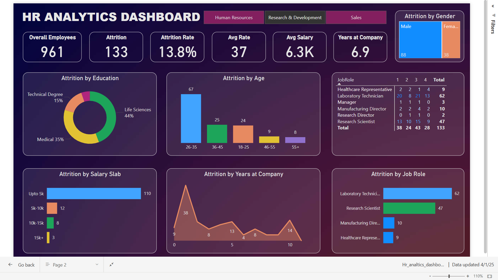

# HR Analytics Dashboard

## Description
A comprehensive HR Analytics Dashboard created using **Power BI** and **Excel** to streamline employee data tracking and visualization. This project provides actionable insights into HR metrics, including employee performance, attrition rates, and other key data points. The dashboard leverages Excel for data management and Power BI for interactive visualizations.

---

## Features
- **Data Management**: Organized and cleaned employee data using Excel for enhanced accuracy.
- **Interactive Dashboard**: Features advanced drill-down capabilities for multi-level analysis.
- **Dynamic Filters**: Customizable slicers and filters for tailored data exploration.
- **Key Metrics Visualized**:
  - Employee attrition rates
  - Performance evaluations
  - Department-wise analytics

---

## Technologies
- **Power BI**: For creating interactive dashboards and visualizations.
- **Excel**: For data cleaning and preprocessing.

---

## Usage
1. Open the `.pbix` file in Power BI Desktop to view the dashboard.
2. Use filters and slicers to explore the data interactively.
3. Refer to the screenshots below for a preview of the dashboard.

---

## Screenshots
### Dashboard Overview

### Drill-Down Analysis

---

## Video Demonstration
[Download the video](Media/Dashboard_working.mp4)

---

## How to Use the Files
- **HR_analytics_dashboard.pbix**: Power BI file for the dashboard.
- **Data.xlsx**: Sample Excel file used for data management (if applicable).
- **Images**: Screenshots of the dashboard for preview.
- **Video**: A short demonstration of dashboard functionality.

---

## Contact
Feel free to reach out for any queries or collaborations:  
[deepakbhatia70561@gmail.com] | [https://www.linkedin.com/in/deepak-bhatia70/]
